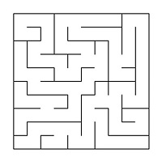

# Algos1-Maze-Cave

Implemetation of the basic algorithms of Maze and Cave handling (generation, rendering, solving) and ML algorithm (Q-learning method) for teaching an agent the shortest passage of mazes.

## Introduction

In this project I've developed desktop app which allow Maze and Cave handling such as generation, rendering, solving. In addition to I've implemented ML algorithm (Q-learning method) for teaching an agent the shortest passage of mazes. GUI developed by Qt 6.5.

## Instructons for running

Being in `src` folder run command `make` and then `make run`.

## Instruction for archiving

Being in `src` folder run command `make dist` that create folder with archived app.

## Instruction for testing

Being in `src` folder run command `make test`

## Instruction for gcov test coverage

Being in `src` folder run command `make gcov_report`

## Documentation

To open library documentation run command `dvi_open`

## App instructions

### Opening file

1) Choose type of file you want to load and push button "Open"


### Maze's shortest path finding

1) Choose type of file (Maze or MazeML) you want to load and push button "Open".

2) Choose input point by left button mouse click. It is green color square.

3) In simple maze case choose output point by right button mouse click. It is blue color square.

4) Push button "Resolve" to find shortest path between two points.

### Maze generation

Specify cols and rows parameters and push "Generate maze file" button.

### Cave file generation

Specify initialization chance parameter and push "Generate cave file"

### Cave generation

1) Choose cave type of file and push button "Open".

2) Specify life and death limit parameters.

3) To generate one step of cave push "Step cave generation"

4) To generate cave automatically specify upload cave time interval and push "Start cave generation". If you want stop generation push "Stop cave generation". You can change parameters and continiue generation.

## Some theory

A maze with "thin walls" is a table of _n_ rows by _m_ columns size. There may be "walls" between the cells of a table. The table as a whole is also surrounded by "walls".

The following is an example of such a maze: \


The solution to a maze is the shortest path from a given starting point (table cell) to the ending one.

When traversing a maze, you can move to neighboring cells that are not separated by a "wall" from the current cell and that are on the top, bottom, right or left.
A route is considered the shortest if it passes through the smallest number of cells.

An example of a maze with its solution:  \


In this example, the starting point is 10; 1, and the ending point is 6; 10.

## Maze description

### Simple maze

The maze can be stored in a file as a number of rows and columns, as well as two matrices containing the positions of vertical and horizontal walls respectively.

The first matrix shows the wall to the right of each cell, and the second - the wall at the bottom.

An example of such a file:
```
4 4 // number of rows and columns
0 0 0 1
1 0 1 1
0 1 0 1
0 0 0 1

1 0 1 0
0 0 1 0
1 1 0 1
1 1 1 1
```

The maze described in this file:  \


### Maze for resolving by ML

Maze ML file similary to simple maze file but only one diffirent : after string with cols and rows information must be specified output point indexes from maze.

An example of such a file:
```
4 4 // number of rows and columns
3 2 // cols == 3, rows == 2
0 0 0 1
1 0 1 1
0 1 0 1
0 0 0 1

1 0 1 0
0 0 1 0
1 1 0 1
1 1 1 1
```

The maze described in this file:  \


## Flaws in mazes

Maze flaws include isolated areas and loops.

An isolated area is a part of the maze with passages that you cannot access from the rest of the maze. For example: \


A loop is a part of the maze with passages that can be walked in "circles". The walls in the loops are not connected to the walls surrounding the maze. For example: \


## Generation using a cellular automaton

In many games there is a need for branching locations, such as caves.
They can be created by generation using the cellular automaton.
The idea of the proposed algorithm consists of implementing only two steps: first, the whole field is filled randomly with walls - i.e., for each cell it is randomly determined whether it will be free or impassable (chance parameter) - and then the map state is updated several times according to the conditions.

There are two special variables, one for "life" of "death" cells (the "life" limit) and one for destruction of "live" cells (the "death" limit).
If "live" cells are surrounded by "live" cells, the number of which is less than the "death" limit, they "die". In the same way, if "death" cells are next to "live" cells, the number of which is greater than the "life" limit, they become "live".

An example of the algorithm's result (the first picture shows only the initialized maze, and the second picture shows a maze in which there are no more changes in subsequent steps): \


## Caves description

A cave that has passed 0 simulation steps (only initialized) can be stored in the file as a number of rows and columns, as well as a matrix containing the positions of "live" and "dead" cells.

An example of such a file:
```
4 4
0 1 0 1
1 0 0 1
0 1 0 0
0 0 1 1
```

The cave described in this file: \
